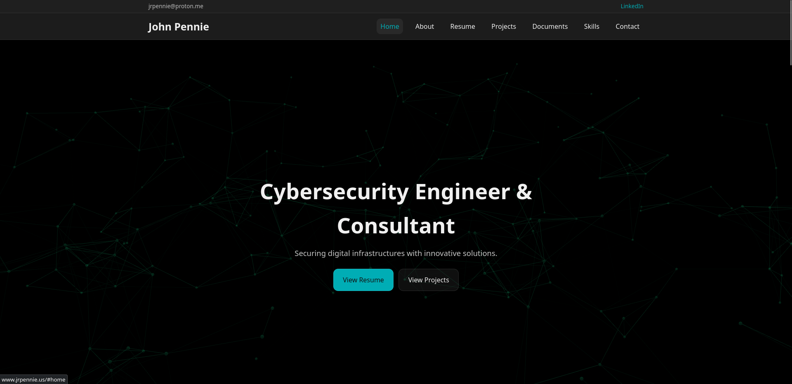

# John Pennie | Cybersecurity Portfolio

**Live site:** https://jrpennie.us/  
**Repo:** https://github.com/jrpennie/Portfolio

## Overview
This repository hosts my personal cybersecurity portfolio website. It includes my resume, selected projects, supporting documents, and contact information.

## Documents
- Resume
- CTF report
- Passive Recon report

## Highlights
- **IT Operations / Enterprise Support**: Windows troubleshooting, identity/access, endpoint security, documentation
- **Homelab Engineering**: Proxmox virtualization, Docker services, Linux administration, storage/networking
- **Detection & Monitoring**: Splunk/Wazuh-style logging, alert triage concepts, security hygiene
- **Projects & Writeups**: Pi-hole, CTF results, passive reconnaissance reporting, and more
## Projects

### 🔹 [Pi-hole — Network Traffic Filtering](https://jrpennie.us/#projects)

DNS-based ad and tracker blocking deployed in a Docker container on a Proxmox virtual machine.

---

### 🔹 [Homelab — Virtualized Security Lab](https://jrpennie.us/#projects)

Personal homelab used for red/blue team simulations, service hosting, and security experimentation.

---

### 🔹 [Capture the Flag (CTF)](https://jrpennie.us/docs/CTF.pdf)

Offensive security exercises completed during a DePaul University course. Recovered 7 out of 9 flags across Windows and Linux hosts.

---

### 🔹 [Passive Reconnaissance](https://jrpennie.us/docs/recon.pdf)

Passive reconnaissance report using open-source intelligence techniques on a selected organization.

---

### 🔹 [WildId — Web Application](https://wildid.jrpennie.us)

Web-based application deployed under a subdomain with a live demo and source code integration.

## Tech Stack
- HTML / CSS / JavaScript
- GitHub Pages

